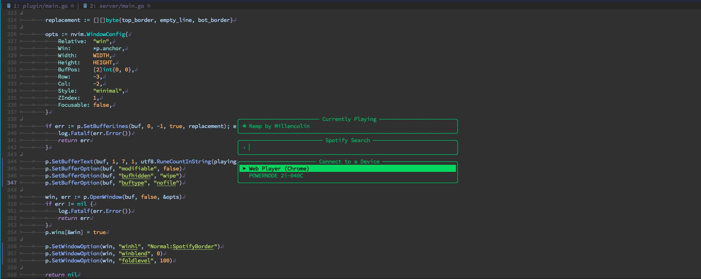

# 🎵nvim-spotify

For productivity addicts who enjoys coding while listening to Spotify, but hates switching to the app to control the music.



## Features

- Display search results on telescope

- Pause/Resume a track
- Skip a track
- Add a track to the library
- Display the name of what's being played
- Select which device to play on
- Search by:
  - Track (`<C-T> or CR`)
  - Album (`<C-L>`)
  - Playlist (`<C-Y>`)
  - Artist (`<C-R>`)

## Requirements

> Unlike other Spotify plugins, you don't need to create an app, and no server is needed on your machine. Although, you still need to authorize this plugin, so it can control your music.

- Golang
- Telescope

## Installation

### [packer](https://github.com/wbthomason/packer.nvim)
```lua
-- Lua
use {
    'KadoBOT/nvim-spotify', 
    requires = 'nvim-telescope/telescope.nvim',
    config = function(),
        local spotify = require'nvim-spotify'

        spotify.setup {
            refresh_token = "YOUR_REFRESH_TOKEN"
        }
    end,
    run = 'make'
}
```

## Configuration

A valid refresh_token is required for this plugin to work.

## Usage

### Default keymaps:
The following keymaps are set by default when the Spotify plugin window is open:
```plain
{"n", "<Esc>"} // close the plugin window
{"n", "q"} // close the plugin window
{"n", "<C-N>"} // Select the next device in the list
{"n", "<Tab>"} // Select the next device in the list
{"n", "<S-Tab>"} // Select the previous device in the list
{"n", "<C-P>"} // Select the previous device in the list
{"n", "<C-T>"} // Search for tracks
{"n", "<C-R>"} // Search for artists
{"n", "<C-L>"} // Search for albums
{"n", "<C-Y>"} // Search for playlists
{"i", "<CR>"}  // Search for tracks
{"i", "<C-N>"} // Select the next device in the list
{"i", "<Tab>"} // Select the next device in the list
{"i", "<C-P>"} // Select the previous device in the list
{"i", "<S-Tab>"} // Select the previous device in the list
{"i", "<C-T>"} // Search for tracks
{"i", "<C-R>"} // Search for artists
{"i", "<C-L>"} // Search for albums
{"i", "<C-Y>"} // Search for playlists
```

### Extra keymaps
 You can also define the additional following keymaps
```lua
vim.api.nvim_set_keymap("n", "<leader>sn", "<Plug>(SpotifySkip)",  { silent = true }) -- Skip the current track
vim.api.nvim_set_keymap("n", "<leader>sp", "<Plug>(SpotifyPause)", , { silent = true }) -- Pause/Resume the current track
vim.api.nvim_set_keymap("n", "<leader>ss", "<Plug>(SpotifySave)",  { silent = true }) -- Add the current track to your library
vim.api.nvim_set_keymap("n", "<leader>so", ":Spotify<CR>",  { silent = true }) -- Open Spotify plugin window
```

